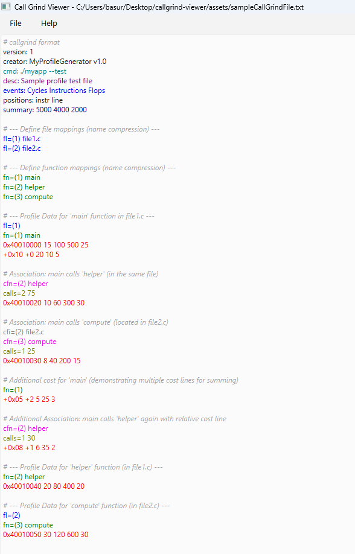

# Simple Text Viewer for Callgrind Files

A lightweight Qt-based text viewer that enhances the readability of Callgrind profiling files through basic syntax highlighting.

## Callgrind File Format

For the syntax highlighting to be applied, ensure that your callgrind profiling file starts with the following line :
`# callgrind format`

## Sample Callgrind File Viewed

## Features

- **Plain Text Viewing:**  
  Load and display text files with a simple, responsive interface.

- **Line Numbering:**  
  A dedicated margin displays dynamic line numbers to help navigate through large files.

- **Code Folding:**

 Foldable regions (determined by function headers starting with `fn=`) can be collapsed by clicking on the arrow in the line number margin. When collapsed, a placeholder overlay is displayed over the folded region with a message indicating the number of lines folded.

  *Click the arrow (▼) to fold a region and reveal a right arrow (►) in its place. Click the overlay to unfold the region.*

- **Callgrind Syntax Highlighting:**  
  The viewer automatically detects and highlights Callgrind-specific tokens, making it easier to analyze profiling output. Key highlights include:
  - **Header Tokens:**  
    - `desc:` – Description of the output.
    - `cmd:` – The command that was run.
    - `part:` – Partition or block number.
    - `events:` – A list of recorded events (e.g., `Ir I1 Dr Dw`).
    - `summary:` – Overall summary of costs.
  - **File and Function Identifiers:**  
    - `fl=` – File names.
    - `fn=` – Function names.
    - `cfl=` – Caller file names.
    - `cfn=` – Caller function names.
    - `cfi=` – Caller file information (with file and line details).
    - `calls=` – Call count information.
  - **Cost Lines:**  
    Numeric lines are highlighted with red support various formats:
    - Plain decimal numbers (e.g., `10 60 300 30`).
    - Compressed tokens (e.g., `3*1` indicating a repeated value).
    - Hexadecimal addresses (e.g., `0x40010020`).
    - Signed numbers (e.g., `+0x10`, `-0`).
    
  - **Comments:**  
    Comments are rendered in gray and italicized.

### Requirements
- Qt 6.8.2 (or a compatible version)
- A C++ compiler that supports C++11 or later

### Acknowledgements
This repository is created as a assignment for **Dr. Pavel Saviankou**
