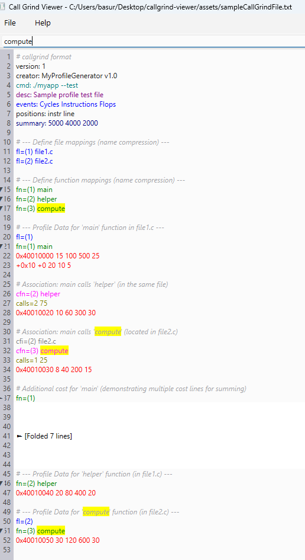

# Simple Text Viewer for Callgrind Files

A lightweight Qt-based text viewer that enhances the readability of Callgrind profiling files through basic syntax highlighting.

## Callgrind File Format

For the syntax highlighting to be applied, ensure that your callgrind profiling file starts with the following line :
`# callgrind format`

## Sample Callgrind File Viewed

## Features

- **Plain Text Viewing:**  
  Load and display text files with a simple, responsive interface.

- **Callgrind Syntax Highlighting:**  
  Improves the visualization of Callgrind profiling output by applying color-based highlighting to key tokens:
  - **File Name Lines (`fl=`):** Highlighted in blue.
  - **Function Name Lines (`fn=`):** Highlighted in dark green.
  - **Numeric Cost Values:** Lines beginning with numeric values are highlighted in red.

### Requirements
- Qt 6.8.2 (or a compatible version)
- A C++ compiler that supports C++11 or later
